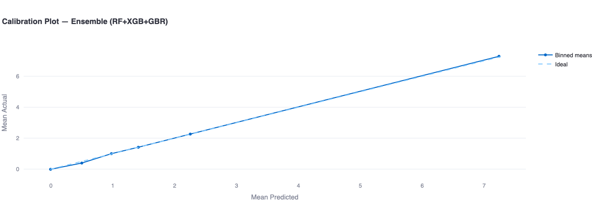
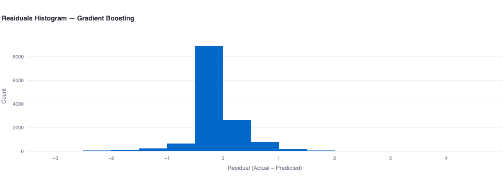
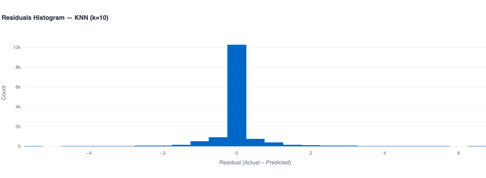

# Fantasy Football AI – Predictive Modeling and Squad Optimization
## Table of Contents
1. [Overview](#overview)  
2. [Methodology](#methodology)  
   - [1. Data Collection](#1-data-collection)  
   - [2. Feature Engineering](#2-feature-engineering)  
   - [3. Model Training](#3-model-training)  
   - [4. Model Evaluation](#4-model-evaluation)  
   - [5. Squad Optimisation](#5-squad-optimisation)  
   - [6. Visualisation & Deployment](#6-visualisation--deployment)  
3. [Models Used and Rationale](#models-used-and-rationale)  
4. [Optimisation Algorithm](#optimisation-algorithm)  
   - [Primary Method: ILP](#primary-method-integer-linear-programming-ilp)  
   - [Fallback Method: Greedy Heuristic](#fallback-method-greedy-heuristic)  
5. [Squad Constraints](#squad-constraints)  
6. [Model Performance Visualisations & Interpretations](#model-performance-visualisations--interpretations)  
   - [1. Actual vs Predicted (Training Data)](#1-actual-vs-predicted-training-data)  
   - [2. Error & Metric Comparison Across Models](#2-error--metric-comparison-across-models)  
   - [3. Predicted Points for the Next Gameweek](#3-predicted-points-for-the-next-gameweek)  
   - [4. Radar Plot (Normalised Metrics)](#4-radar-plot-normalised-metrics)  
7. Additional Analysis](#5-Additional-Analysis)
   - [1. Calibration Plots](#1-calibration-plots)
   - [2. Residual Histograms](#2-residual-histograms)
   - [3. Per Position Metrics](#3-per-position-metrics)
   - [4. K fold Cross Validation](#4-k-fold-cross-validation) 
8. [Conclusions](#conclusions)  
9. [Limitations](#9-limitations)
10. [Future Scope](#10-future-scope)
9. [Project Structure](#project-structure)  
10. [Requirements & Installation](#requirements--installation)  
11. [How to Run](#how-to-run)  
12. [References](#references)  

## Overview
**Fantasy Football AI** is an advanced predictive analytics and optimisation system for building high-performing Fantasy Premier League (FPL) squads.  
It uses historical player data and machine learning models to **forecast player points** for upcoming gameweeks, then applies **squad optimisation algorithms** to select the best possible team within FPL’s rules and budget constraints.  

The system is delivered as an **interactive Streamlit web application**, enabling users to:  
- Train and compare multiple ML models on past FPL data  
- Visualise performance metrics and feature importances for each models 
- Optimise squads using Integer Linear Programming (ILP) or a robust greedy fallback  
- Analyse predictions through diagnostics, calibration, and residual checks  
- Export results including squad lists, performance tables, and plots for further analysis  

## Methodology
### 1. Data Collection
- **Source:** [Vaastav FPL Dataset](https://github.com/vaastav/Fantasy-Premier-League)  
- Historical Fantasy Premier League player data including match-by-match statistics, player metadata, and gameweek identifiers.  

**NOTE**: We have used the player stats for the 2024 - 2025 season for the project (21 gameweeks out of 38 gameweeks data was available).

### 2. Feature Engineering
- Extracted and cleaned relevant numerical and categorical features:  
  - **Performance metrics:** minutes, goals, assists, clean sheets, bonus points, ICT index.  
  - **Advanced stats:** expected goals (xG), expected assists (xA), expected goal involvements, expected goals conceded.  
- Steps: handle missing values, encode categorical variables, standardise numeric features, aggregate by player & gameweek.  

### 3. Model Training
- Models: Linear Regression (LR), Random Forest (RF), Gradient Boosting (GBR), XGBoost (XGB), KNN  
- Training: all gameweeks except the latest, holding out next GW for prediction.  
- Evaluation: in-sample metrics.

### 4. Model Evaluation
- Metrics: MAE, RMSE, R², Explained Variance, MedAE, Spearman correlation, Top-K overlap.  

### 5. Squad Optimisation
- **Objective:** select an optimal 15-player squad and XI under FPL rules.  
- **Constraints:** budget (100), 2 GKs, 5 DEFs, 5 MIDs, 3 FWDs, max 3 per club, min spend 95%, minutes threshold (min 60 minutes).  

### 6. Visualisation & Deployment
- Visual outputs: radar charts, residuals, calibration plots, Top-K tables.  
- Deployment: interactive Streamlit web app with exportable results.  

## Models Used and Rationale
1. **Linear Regression** – baseline for interpretability.  
2. **KNN** – non-parametric, predictions based on similarity.  
3. **Random Forest** – ensemble of decision trees, handles non-linearities.  
4. **XGBoost** – high-performance gradient boosting.  
5. **Gradient Boosting Regressor** – sequential boosting, strong on tabular data.  
6. **Ensemble (RF + XGB + GBR)** – combines strengths of tree-based models.  

## Optimisation Algorithm
### Primary Method: Integer Linear Programming (ILP)
- **Library:** PuLP  
- **Objective:** maximise predicted points under FPL constraints.  
   - Maximize objective function which is the sum of predicted points with weights applied for captain and vice captain.
   - Uses a Coin or Branch and Cut (CBC) Solver which randomly divides the dataset into different possible squad combinations and works by elimination if the squad doesn't meet our constraints.

### Fallback Method: Greedy Heuristic
- When ILP infeasible or unavailable.  
- Sorts players by predicted points, selects under constraints, builds a valid XI.  

## Squad Constraints
- Squad: 15 players  
- Positions: 2 GK, 5 DEF, 5 MID, 3 FWD  
- Budget: 100 (95% min spend)  
- Max 3 players per club  
- XI formation rules: 1 GK, 3–5 DEF, 2–5 MID, 1–3 FWD  
- Captain & Vice-Captain auto-selection  

## Model Performance Visualisations & Interpretations
### 1. Actual vs Predicted (Training Data)
  
**Interpretation:** Orange dashed = ideal line. Predictions cluster well for mid-range points. Tree-based models + Ensemble are closest to ideal, LR and KNN weaker.  

### 2. Error & Metric Comparison Across Models
  
**Interpretation:** XGBoost and Ensemble best in error (MAE, RMSE) and variance explained. Ranking (Spearman, Top-K overlap) also dominated by tree-based models. LR and KNN underfit the data.  

### 3. Predicted Points for the Next Gameweek
  
**Interpretation:** Forecasted average points per model for GW21. All models predict close values, boosting slightly higher. XGB/Ensemble most reliable for optimisation.  

### 4. Radar Plot (Normalised Metrics)
  
**Interpretation:** Normalised (1.0 = best). Ensemble broad coverage across metrics. XGB and RF also strong. LR and KNN show weakest coverage.  
**NOTE**: Error metrics are normalized to make values higher the better.

**Interpretation:** XGBoost best in accuracy metrics. Random Forest strongest in consistency and correlation. Ensemble excels in ranking ability (Top-K overlap).  

## Additional Analysis

To further validate the models, we attempted **calibration plots** and **residual histograms**. These provide deeper insights into model reliability beyond standard metrics.  

### 1. Calibration Plots  
- **Goal:** Assess whether predicted points align with actual points on average.  
- **Method:** Compare mean predicted vs. mean actual across bins of predictions.  

**Plots & Interpretation:**  

#### Ensemble (RF+XGB+GBR)  
  
Shows excellent alignment with the ideal line → well-calibrated predictions.  
#### Gradient Boosting  
  
Very close to ideal, slightly more spread at higher predictions.  
#### KNN (k=10)  
  
Good calibration at low/mid predictions but underestimates higher values.  
#### Linear Regression  
  
Systematic underestimation of top scorers, weakest calibration.  
#### Random Forest  
  
Almost perfect calibration across the full range.  
#### XGBoost  
  
Near-ideal calibration, among the strongest models.  


### 2. Residual Histograms  
- **Goal:** Assess error distribution (Residual = Actual − Predicted).  
- **Method:** Visualise how tightly residuals cluster around zero.  

**Plots & Interpretation:**  

#### Ensemble (RF+XGB+GBR)  
  
Tightly centered around zero, minimal spread → stable performance.  

#### Gradient Boosting  
  
Well-centered but slightly more spread than XGB/Ensemble.  

#### KNN (k=10)  
  
Wider tails, reflecting sensitivity to scaling and neighbor selection.  

#### Linear Regression  
  
Broadest spread with many outliers, confirming underfitting.  

#### Random Forest  
  
Very narrow and symmetric distribution, low error variance.  

#### XGBoost  
  
Extremely sharp distribution at zero, best-performing model.  


### 3. Per-Position Metrics  

To evaluate how models perform across different player roles (DEF, FWD, GK, MID), we computed **Mean Absolute Error (MAE)** and **Root Mean Squared Error (RMSE)** per position. This provides finer insight into whether certain models are better at predicting specific positions.  

#### Per-Position MAE  
  

- **XGBoost** consistently has the lowest MAE across all positions, showing high accuracy for both attackers and defenders.  
- **Random Forest** also performs strongly, especially for Goalkeepers (GK) and Defenders (DEF).  
- **Ensemble (RF+XGB+GBR)** balances performance, reducing error variance across all positions.  
- **KNN** performs worse for MIDs and DEFs, reflecting sensitivity to data scaling.  
- **Linear Regression** has the highest MAE across all positions, confirming underfitting.  

#### Per-Position RMSE  
  

- **XGBoost** again achieves the lowest RMSE across all positions, with very small errors in predicting Forwards (FWD).  
- **Ensemble** is close to XGB, with slightly higher variance.  
- **Gradient Boosting** is solid but weaker compared to XGB and Ensemble.  
- **KNN** and **Linear Regression** show high RMSE across positions, making them less reliable for squad optimisation.  

#### Table — Per-Position Metrics  

The full per-position MAE and RMSE values for all models are available in:  

[`tables/PerPositionMetric.csv`](tables/PerPositionMetric.csv) 

### 4. K-Fold Cross Validation  

To further assess model generalisation and avoid overfitting, we attempted **K-Fold Cross Validation**.  
Instead of evaluating models on a single train/test split, the dataset was divided into **K folds (here K = 5)**, ensuring that each gameweek (GW) appears in both training and validation at different iterations.  

**Why K-Fold CV?** 
- **Robustness:** Provides a more reliable estimate of model performance compared to a single split.  
- **Fairness:** Ensures all data points are used for both training and validation.  
- **Leakage Prevention:** By grouping data by gameweek, we avoid using future information in training.  

**Results**: 
The full results are stored in:  

[`tables/CVKfold.csv`](tables/CVKfold.csv)  

This table contains average performance metrics across the folds (MAE, RMSE, R², etc.) for all models.  

**Interpretation** 
- **XGBoost and Ensemble models** consistently achieve the lowest errors across folds, confirming their strong generalisation.  
- **Random Forest** also performs well but with slightly higher variance across folds.  
- **Gradient Boosting** is stable but slightly weaker compared to XGB and Ensemble.  
- **Linear Regression and KNN** underperform, showing higher variability and weaker predictive strength. 

## Conclusions  
- **XGBoost** delivered the best accuracy across error metrics.  
- **Random Forest** showed strong consistency and correlation with actual outcomes.  
- **Ensemble (RF + XGB + GBR)** achieved the best player ranking ability (Top-K overlap).  
- **Tree-based models** were well-calibrated with tightly centered residuals, unlike LR and KNN which underfitted.  
- **Per-position metrics** confirmed XGBoost as the most reliable across all roles.  
- **K-Fold CV** validated the generalisability of Ensemble and XGBoost.  
- Best pipeline: **XGBoost/Ensemble predictions → ILP optimisation → Greedy fallback**.  

## Limitations

Despite strong performance, the current framework has several limitations:
- Limited Hyperparameter Tuning: Models were trained mostly with default parameters.
Lack of systematic tuning (e.g., for max_depth in RF/XGB or neighbors in KNN) might have limit predictive accuracy.
- Simplified Optimisation: The ILP solver (CBC) maximises single-gameweek points. Long-term strategies (transfers, chip usage, fixture rotations) are not modelled.
- Data Availability: Only 21 gameweeks of the 2024/25 season were available, restricting training depth. No injury/suspension/fixture congestion data included.
- Feature Scope: Predictions rely mainly on historical performance and xG/xA. External factors (team tactics, new signings, opponent strength, home/away dynamics) are excluded.
- Scalability: Optimisation runtime grows quickly with more constraints or larger datasets.

## Future Scope

The current version of Fantasy Football AI provides a strong foundation for predictive squad optimisation. Future enhancements could include:
- Hyperparameter Tuning
Applying GridSearchCV, RandomizedSearch, or Bayesian optimisation for RF, GBR, and XGB to improve prediction robustness.
- Advanced Optimisation Models
Incorporating Mixed Integer Programming (MIP), stochastic programming, or genetic algorithms for multi-week squad planning and transfer strategies.
- Live Data Integration
Direct API integration with the official FPL platform to update player stats, injuries, and fixture changes in real-time.
- Transfer & Chip Strategy
Extending optimisation to handle weekly transfers, bench boosts, wildcards, and triple captaincy for long-term planning.
- Scalability to Other Leagues
Generalising the framework to work with fantasy sports from other leagues (La Liga, Serie A, IPL, NFL Fantasy).
- User Personalisation
Allowing users to set custom preferences (e.g., risk-taking vs. conservative, team allegiance, favourite formations).

## Project Structure
```
project/
├── app.py # Streamlit application
├── README.md # Documentation
├── data/ # Input datasets
│ └── merged_gw.csv
├── plots/ # Generated plots and visualisations
│ ├── ActualvsPredicted.png
│ ├── ErrorComparison.png
│ ├── PredPoints_nxtweek.png
│ ├── RadarChart.png
│ ├── En_Histogram.png
│ ├── GB_Histogram.png
│ ├── kNN_Histogram.png
│ ├── LR_Histogram.png
│ ├── RF_Histogram.png
│ ├── XG_Histogram.png
│ ├── En_callibration.png
│ ├── GB_callibration.png
│ ├── kNN_callibration.png
│ ├── LR_callibration.png
│ ├── RF_callibration.png
│ ├── XG_callibration.png
│ ├── PPM_MAE.png
│ ├── PPM_RMSE.png
│ └── ... (additional residuals and metrics)
├── tables/ # Evaluation tables
│ ├── ModelComparison.csv
│ ├── PerPositionMetric.csv
│ └── Squad_XGBoost.csv
├── PROJECT_POSTER.pdf # Final poster
└── Literature_Review.pdf # Supporting reference material
```

## Requirements & Installation
Ensure you have **Python 3.9+** installed.  

Install dependencies using:  
```bash
pip install -r requirements.txt
```

## How to Run
Clone or download this repository.

1. Navigate into the project folder in terminal or VS Code.
2. Place your input dataset (merged_gw.csv) into the data/ directory.
3. Install dependencies:
pip install -r requirements.txt
4. Run the Streamlit app:
streamlit run app.py

5. Use the app to:
Train models and compare performance
View plots and error metrics
Optimise a squad using ILP or greedy fallback

## References
[1] Vaastav Anand. Fantasy Premier League Data Repository. https://github.com/vaastav/Fantasy-Premier-League, 2024. Accessed: 2025-06-13.  
[2] Malhar Bangdiwala, Rutvik Choudhari, Adwait Hegde, and Abhijeet Salunke. Using ML models to predict points in Fantasy Premier League. In *2022 2nd Asian Conference on Innovation in Technology (ASIANCON)*, pages 1–6. IEEE, 2022.  
[3] IBM. IBM Watson Fantasy Football. https://www.ibm.com/thought-leadership/fantasy-football/index.html, 2024. Accessed: 2025-06-13.  
[4] Prof. Dr. S. N. Sarda, Rishikesh Sahu, Atharva Ingole, Aditi Patil, and Akansha Tarpe. Fantasy Football Team Prediction Using ML. https://www.doi.org/10.56726/IRJMETS54188, 2024. Accessed: 2025-06-13.  
[5] Mitchell, S., Mason, A., & OSI Community. PuLP: A Linear Programming Toolkit for Python. https://coin-or.github.io/pulp/  
[6] Breiman, L. (2001). Random Forests. *Machine Learning*, 45(1), 5–32.  
[7] Friedman, J. H. (2001). Greedy function approximation: A gradient boosting machine. *Annals of Statistics*, 29(5), 1189–1232.  
[8] Chen, T., & Guestrin, C. (2016). XGBoost: A Scalable Tree Boosting System. In *KDD '16*.  
[9] Pedregosa, F., Varoquaux, G., Gramfort, A., et al. (2011). Scikit-learn: Machine Learning in Python. *JMLR*.  